# SenseAI — AI Analyst for Startup Evaluation 📊

SenseAI helps investors move from manual research to fast, grounded insights. Built with Google's ADK and Gemini, it combines agentic research, multimodal analysis, and contextual chat to produce investment-ready insights.

- Live demo: https://sense--ai.vercel.app/
- Video demo: https://www.youtube.com/watch?v=PWvQIz2qNng

> Update: This project won the <b>2nd runner up position</b> in <b>Google GenAI Exchange Hackathon</b>. Below are pictures from the finale held on 29th November 2025 in Bangalore.

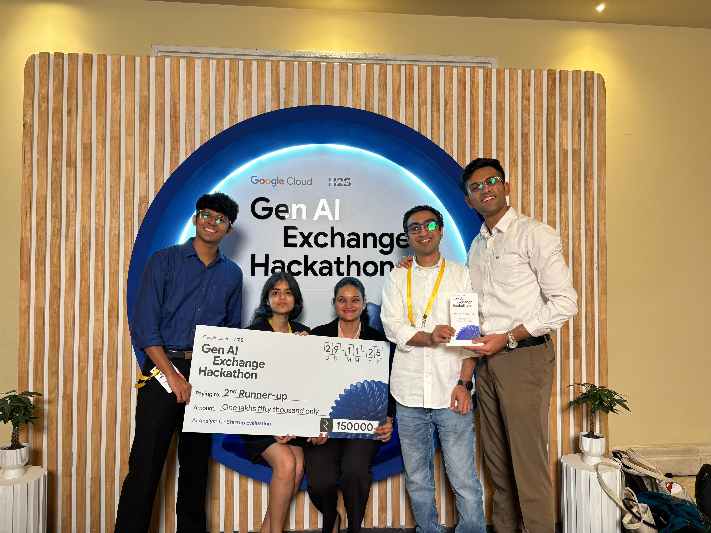

---

## Why SenseAI?

- Fast, agent-driven research that aggregates and grounds findings in Google Search.
- Multi-modal: analyze pitch decks, audio/video calls, transcripts, and documents.
- Actionable outputs: numeric SenseAI score, red-flag fact checks, and audio newsletters.

---

## Key Features

- 🔎 **Agentic Research**

  - Automated agents gather funding history, leadership profiles, market sizing, and news/announcements.
  - Grounded sources using Google Search for higher trust and traceability.
    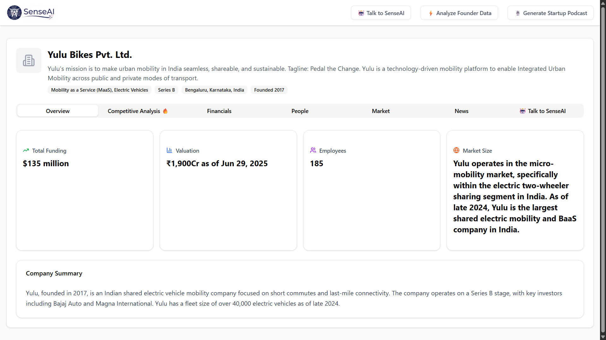

- 💬 **Context-aware Chatbot**

  - Ask targeted questions about a company and receive answers grounded in collected evidence and documents.
    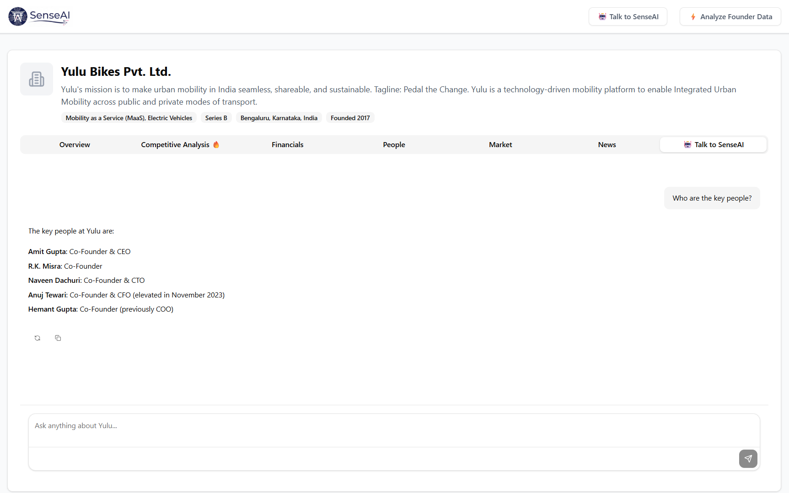

- 📊 **SenseAI Score — 4-Dimensional Scoring**

  - A compact score across Revenue Growth, Financial Strength, Industry Health, and Founder Background.
  - Helps compare companies quickly and spot strengths/weaknesses.
    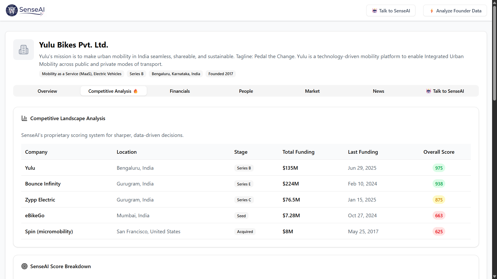
    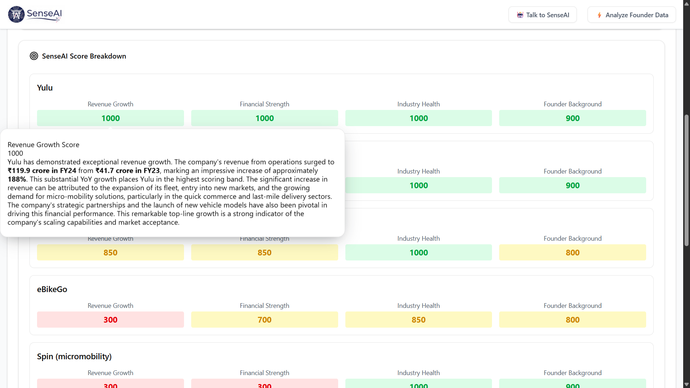

- 📚 **Multi-modal Founder Material Analysis**

  - Summarizes pitch decks, extracts key claims, and analyzes transcripts and notes.
  - Supports PDF, audio, video, and plain-text inputs.
    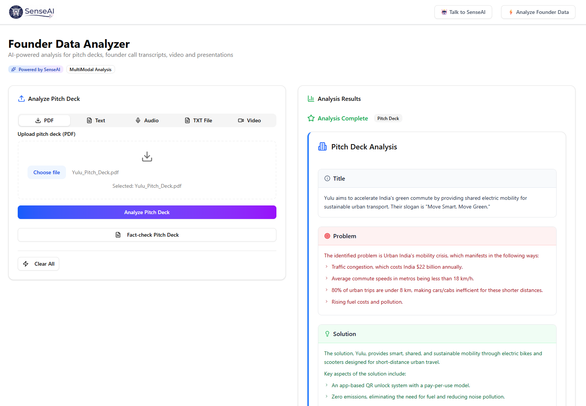

- ✅ **Agentic Fact Check**

  - Detects potential exaggerations and verifies factual claims (e.g., market size assertions).
    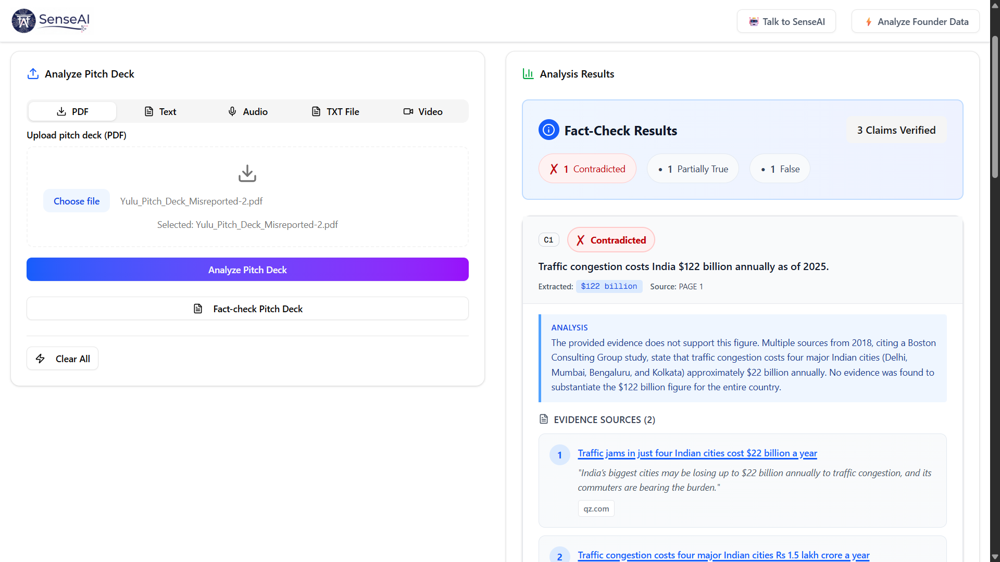

- 🎧 **Podcast & Newsletter Generator**
  - Generate audio podcasts and market newsletters from agent-summarized content.
  - Supports regional languages (including Hindi) to improve accessibility.
    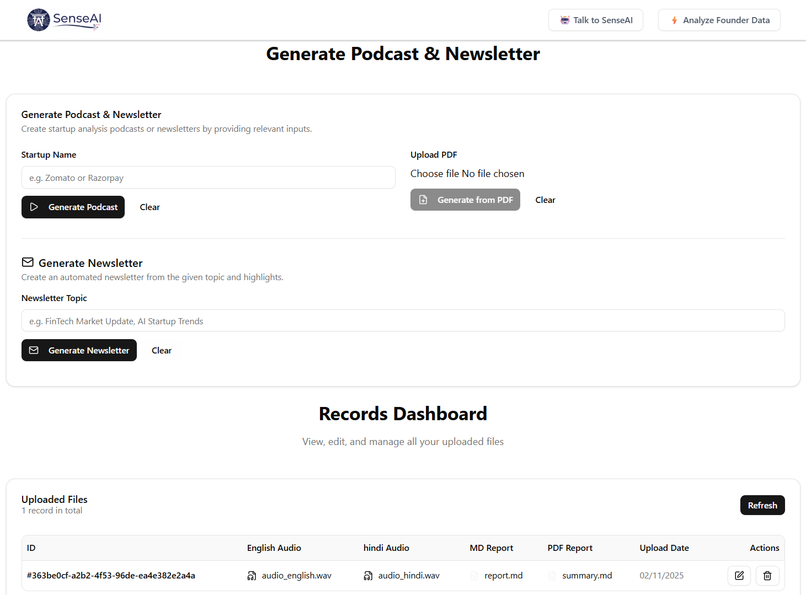

---

## Try it

1. Visit the live app: https://sense--ai.vercel.app/
2. Watch the demo: https://www.youtube.com/watch?v=PWvQIz2qNng

## Agent Usage

We created 4 main agents and about 20 specialized sub-agents to power all our features.

Here are they:

1. Company Analysis Agent

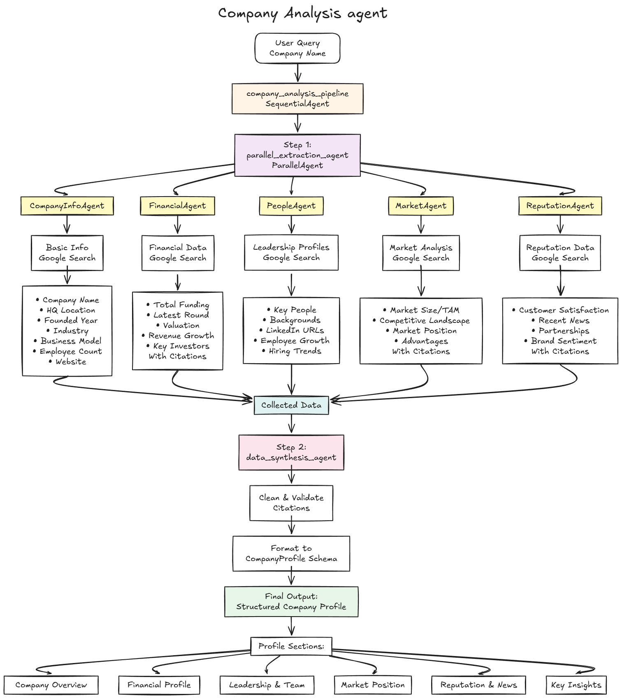

2. Competitor Analysis Agent

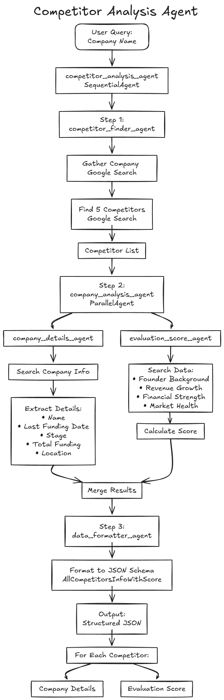

3. Fact Check Agent

4. Market Analysis Agent (with Podcast Generation)

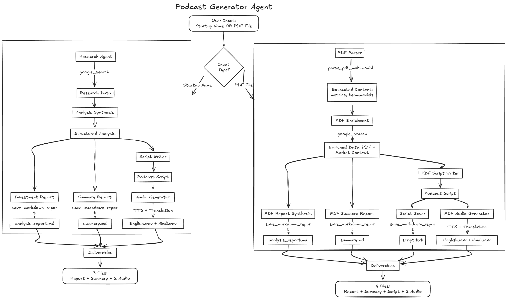

Following diagram shows how we used Gemini API for Founder Data Analysis feature:

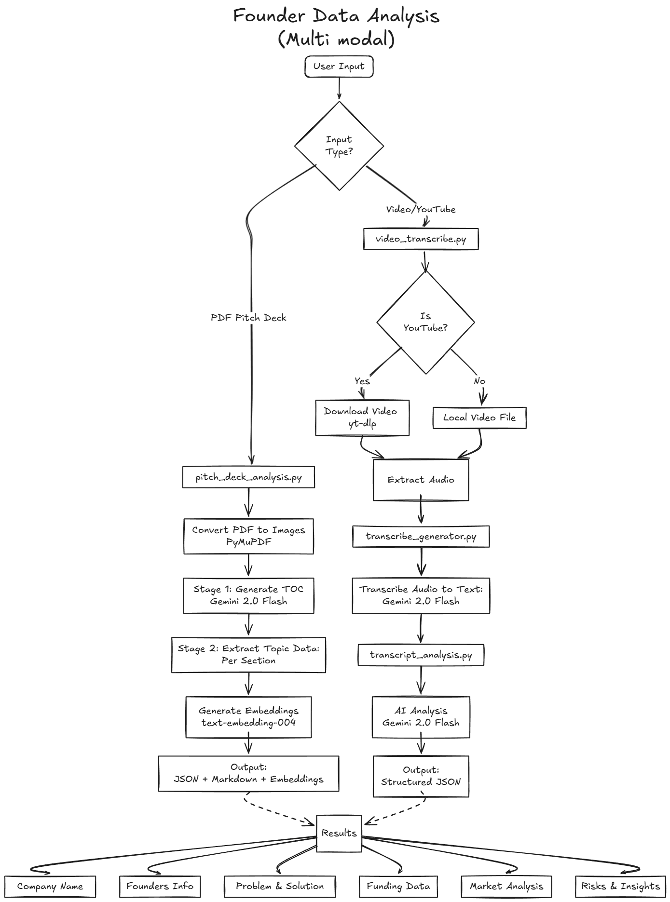
---
