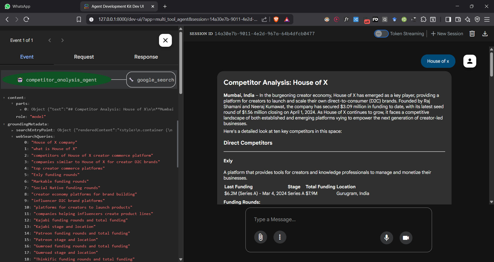

## Article I followed
https://google.github.io/adk-docs/get-started/quickstart/#agentpy

## Commands
pip install google-adk -q
cd experiments\root
adk web

## Insights

- agent result
    
- ground truth
    

