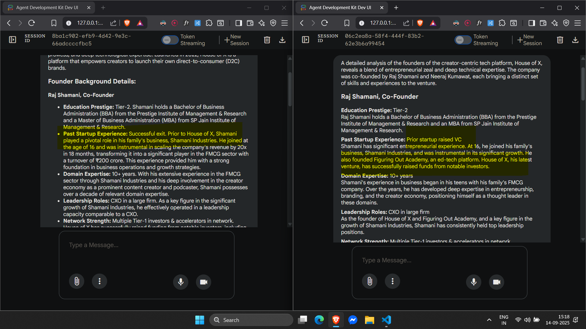

## Article I followed
https://google.github.io/adk-docs/get-started/quickstart/#agentpy

## Commands
cd D:\DMisc\google-ai-hack\experiments\root2
adk web

## Insights

- There can be multiple answers that are correct. Pick the one that gives more points

- I think the model is more aware with guidelines on what to do when there are more than two answers for the same attribute like multiple degrees
SP Jain should've been Tier-1 though

Team Pillar (Team Score)
1. Founder Bg Score
2. Team Stability Score
3. Network strength Score

Financial Pillar (Financial Score)
4. Revenue Growth Score
5. Burn & Runway Score
6. Unit Economics Score

Market & Traction
7. Customer Growth Score
8. Retention Score
9. Market Size Validation Score

Governance
10. Board Score
11. Advisory Score
12. Legal Compliance Score
13. Internal Policies Score